```{r setup, include=FALSE}
knitr::opts_chunk$set(echo = FALSE)
```

## Correlation is Not Causation

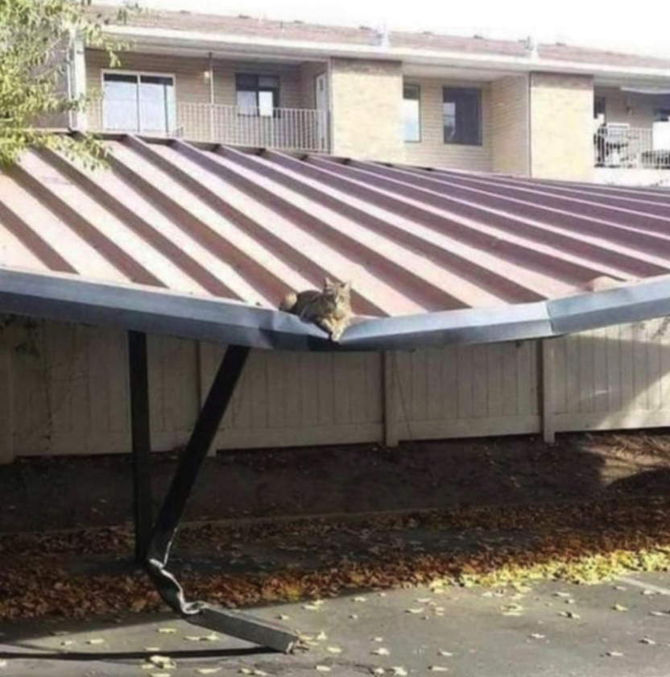
## 

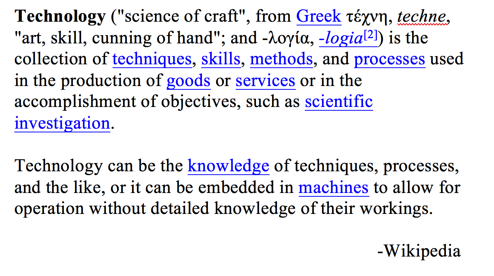
`

## Teaching is Also Tough


## Teaching is Also Tough

> "I feel a large part of music education is a disaster today. A lot of it is coming from people who don't know how to teach"

## Wild Claims !

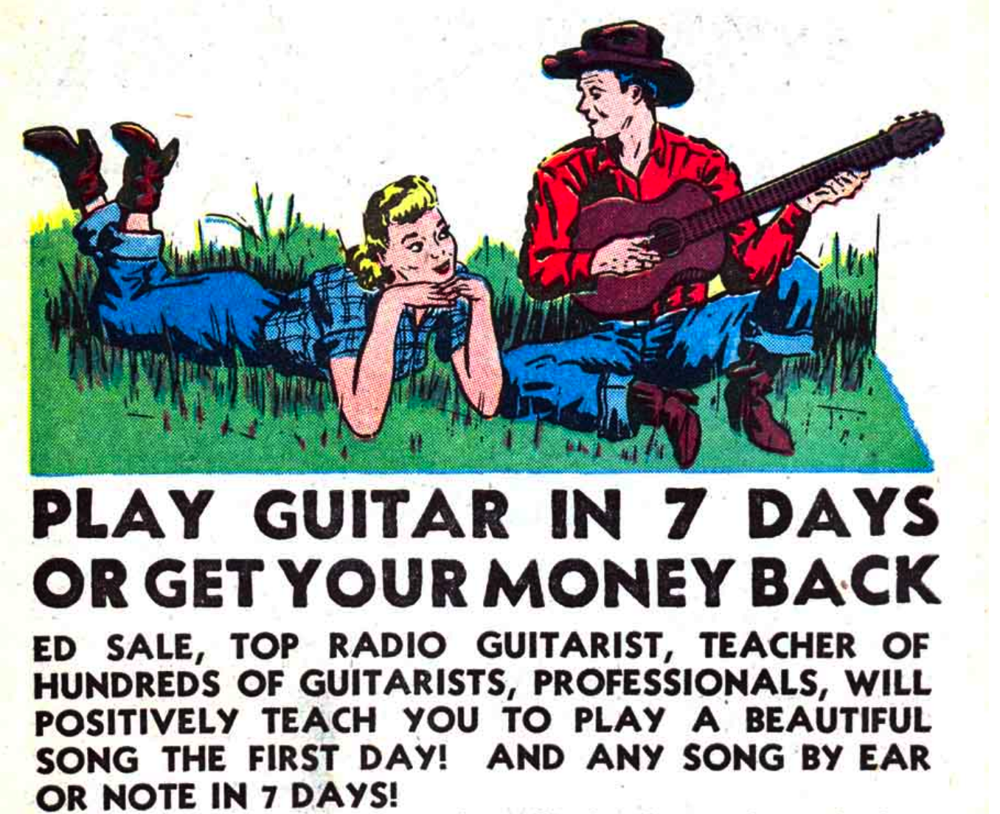

## Have to be able to play this


## Before playing this


## Wild Claims Continued ?

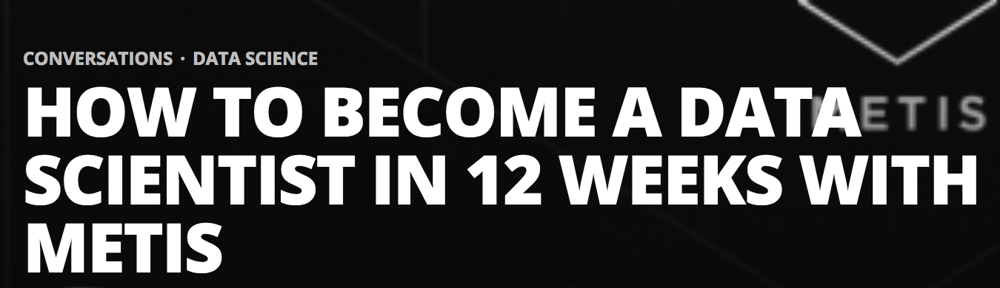

## Specialization Trend

- R for Business Intelligence
- Data Science for Epidemiologists
- Data Science for Nursing Research
- Intro to Statistics using R
- Data Visualization for Biologists
- Statistics for Clinicians
- Machine Learning for City Planners
- R for SAS Programmers

## Evolution of Data Science Roles

- Data Scientist
- Data Analyst
- Data Engineer
- Data Architect
- Chief Data Officer 

## I (Co)Teach Several Classes and Do Frequent Guest Lectures

* BIOS 545 Introduction to R Programming 
     + For BIOS students only (for the most part)
     + Ground up introduction to R
     + Fast-paced 
     + Assumes some previous programming

\hspace{1cm}

* BIOS 534 Introduction to Machine Learning
    + Drafted at the last minute to help out
    + Blend of theoretical and practical
    + Students don't like the theoretical yet it's important
    + The practical draws together lots if approaches
    + Everyone thinks Data Science is all Deep Learning

## Guest Lectures

*  Nursing 741 Big Data Analytics 
    + Analyze ethical issues related to the use of big data in health related research
    + Understand the principles of reproducible research 
    + Analyze ethical issues related to big data analytics in health related research
    
\hspace{1cm}

* LAW 890 Fundamentals of Innovation 
  
\hspace{1cm}

> TI:GER, brings together graduate students in law, business, science, and engineering to work on start-up projects to transform highly promising research into economically viable projects.

(https://tigerinnovation.org/)
    
## Lean Start-up

Most of what I do (or try to) is based on the Lean Start-up Concept
which relies heavily on "customer discovery". 

* Seventy five percent of ALL business start-ups fail
* Cool technology and ideas are frequently NOT ready for market
* Large Business Plans are conceived using stale market research
* No one "really" wants to talk to customers

## Lean Start-up Continued

Lean Start-up avoids this by:

* Frequent hypothesis testing over elaborate planning
* Customer feedback over intuition or "we know what's best"
* Iterative Design (e.g. Fail towards success) over Big Design
* Frequent "pivots" into new directions

https://leanlaunchpad.stanford.edu/
https://steveblank.com/slides/lean-startup/

## Lean Start-Up Continued

Using this approach I have:

- Obtained a patent
- Gotten funding from Georgia Research Alliance 
- Active Intellectual Property declarations with Emory OTT 
- Function as Entrepreneurial Lead for a Natural Language Processing recruitment tool

# Motivating Learning

## Why Do You Take a Class ? 

- The course is required
- It will be useful for later work
- Someone advised me to take this class
- I couldn't find a more interesting course to take

## (Better) Motivations for Learning ?

- Less reliance upon others
- Enhanced productivity
- Eliminate barriers to research
- Improve employment prospects

\hspace{1cm}

### *You Are Really Facilitating Independence*

  - As a teacher or student  you SHOULD have this goal
  - You Need to know the material
  - Better Yet, you need to know how to explain it

## Feynman Approach 

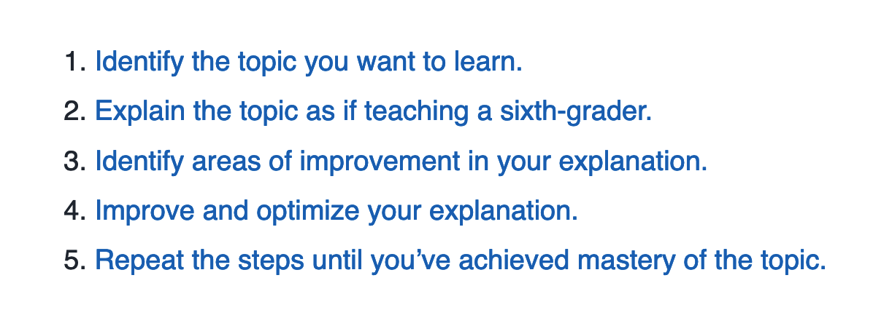{width=90%}
Relative to step 2, replace the phrase "sixth grader" with a term corresponding to a beginner relative to the topic of interest (e.g. "first year")

## Thelonious Monk Approach

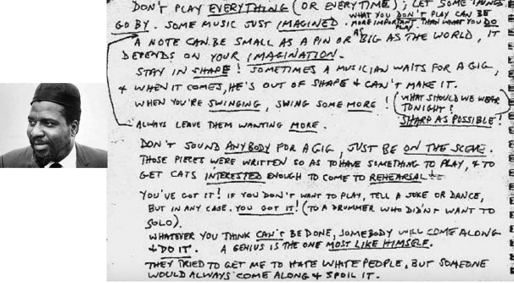

## Thelonious Monk Approach

### "Stop playing all those weird notes, play the melody"

- Focus on the basics and build into the "edge" cases. 
- Don't start with oblique or uncommon topics 
- Explain exceptions AFTER having laid the foundation

\hspace{1cm}

### "Just because you are not a drummer, doesn't mean you don't have to keep time"

  - The phrase "keeping time" means establishing a pace and reliable pulse
  - Some class sessions will be harder than others but the "pulse" should be same across all sessions.
  
## Thelonious Monk Approach

### "Stay in shape. Sometimes a musician waits for a gig and when it comes, he is out of shape and can't make it"

\hspace{1cm}

Being "in shape" refers to readiness for playing (not necessarily physical shape). Do your rehearsals and practice so you are ready for action. Be ready to improvise.


## Example

In a linear regression model, how does $R^2$ differ from Adjusted $R^2$ ?

$$ RSS = \sum_{i=1}^n (y_i - f(x_i))^2 $$
$$ TSS=\sum_{i=1}^{n}\left(y_{i}-\bar{y}\right)^2 $$
$$ R^2 = 1 - {RSS\over TSS} \ $$
$$ R^2 Adjusted = 1 - {{(1 - R^2)(N - 1)}\over N - p - 1} $$
Discussion ? Where to Start ? Recitation of Learned Facts ?

# Reproducibility and Availability

## Crisis

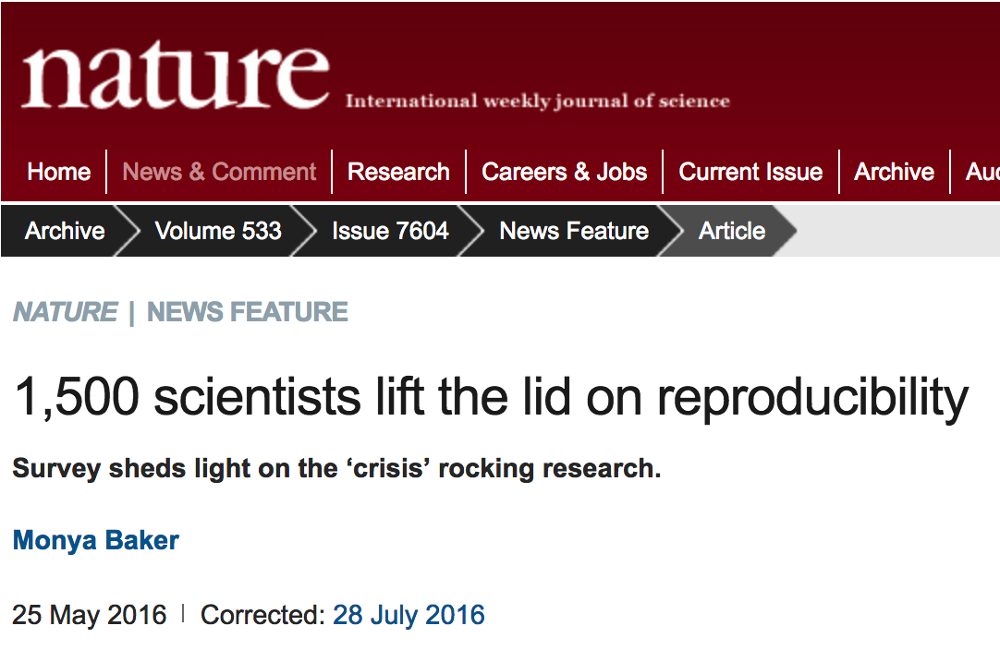

## Use Reproducible Research Tools

- Sweave
- knitr
- Markdown
- Jupyter

## Use Git !!

- Great for Backing Up Your Code 
- Can handle multiple versions
- Can Share with others
- Others can modify and submit changes
- Issue Tracking
- Contains a Wiki


## Learning Analysis and Programming


### Like Learning to Cook

- Start with a good recipe
- Demonstration (by a competent cook)
- Observation (by students)
- Duplication (basic repetition)
- Imitation (repetition with changes)
- Fear of Messing Things Up 

## Just Eat Frozen Food or Eat Out

- Unhealthy
- Little Variation
- Expensive
- No Self Sufficiency
- No Independence

# Creating Interesting Material

## Think of an encompassing project

- For advanced students give them the project all at once

- For Intro classes cover each subtopic per week
      + Homework and Labs
      + Maybe a final project
      
- For Intermediate classes do a combination
      + Have mid term and final projects
      + Some supporting homework

## Yum !


## 

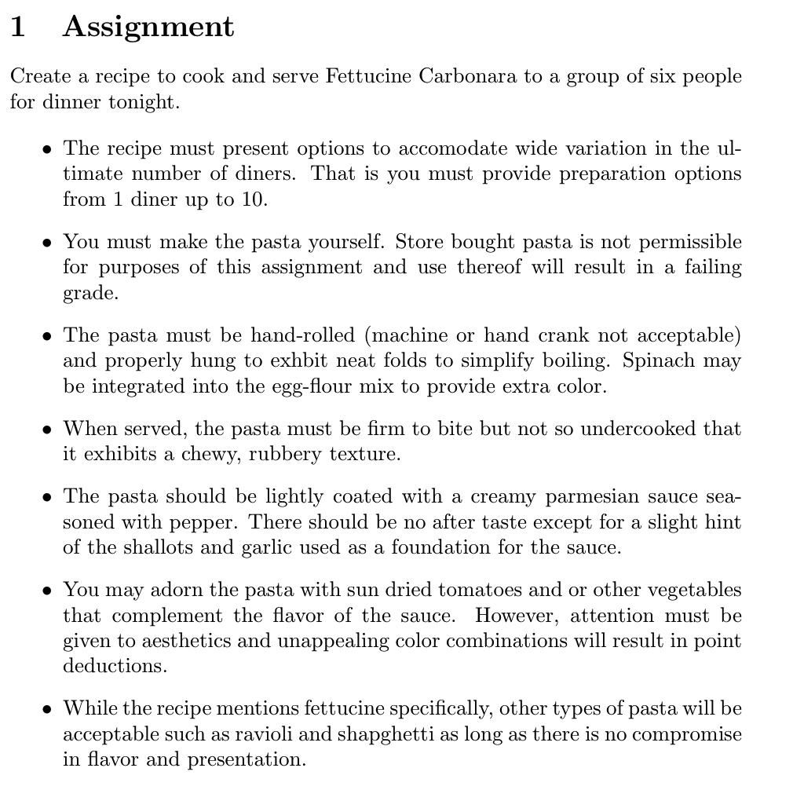

## Make the Pasta

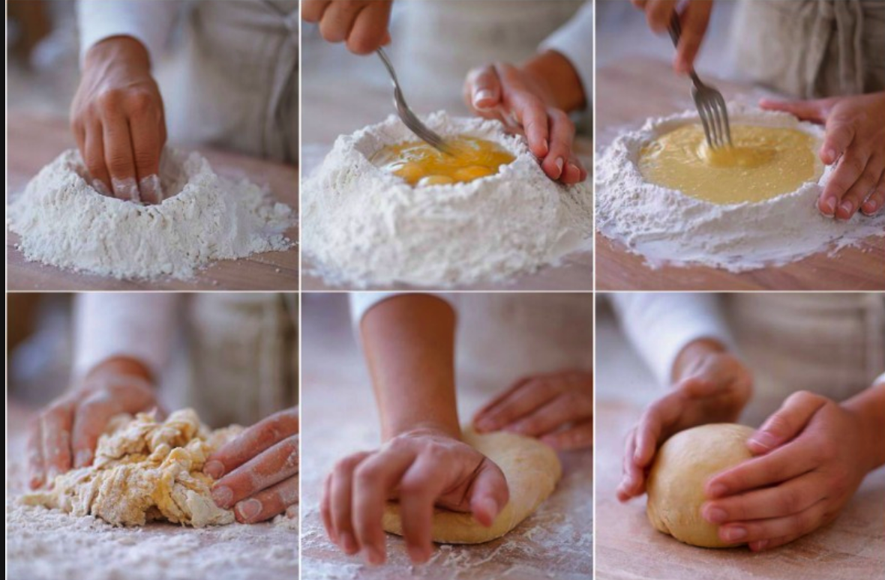

## Cut the Pasta

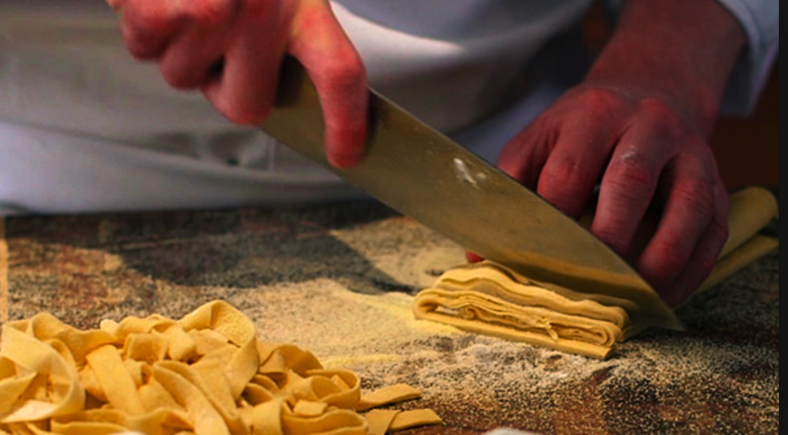

## Dry the Pasta


## Make the Sauce


## Boil Pasta

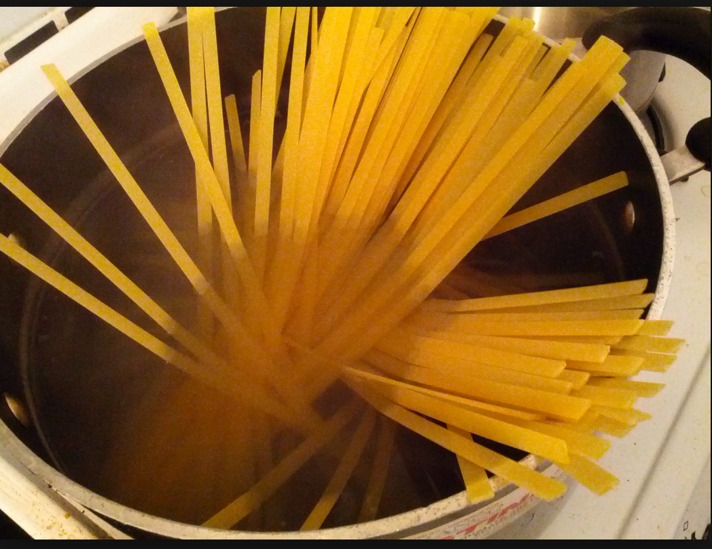


## Programming Assignment

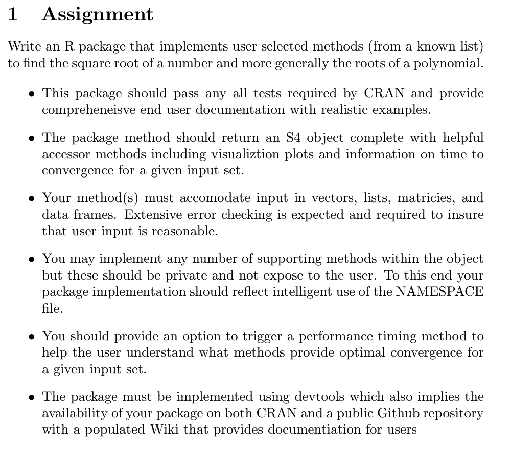
```{r fig.width=6, fig.height=6, echo=FALSE}
library(png)
library(grid)
img <- readPNG("img/assi2.png")
grid.raster(img)

```

## You Gotta Break Things Up

Solving for $\sqrt{S}$ is the same as solving $f(x) = x^2 - S = 0$

We can use Newton's Method to iterate towards an answer:

$$x_{n+1} = x_{n} - \frac{f(x)_n}{f'(x)_n} = x_n - \frac{x_{n}^2 - S}{2x_n} = \frac{1}{2}(x_n + \frac{S}{x_n})$$
Make a first guess and then compute $x_{n+1}$ until $x_{n+1}^2$ is close enough to S within some specified tolerance

## A Beginning Approach

```{r, eval=FALSE, echo=TRUE}
Make a guess (e.g 2) of the square root of some number (e.g. 16)
Specify a tolerance level (e.g. 0.0001)

while the absolute value of the square of that guess minus 
      the number  is >= than tolerance
          compute a new guess
```

```{r, eval=FALSE, echo=TRUE}
somenum <- 16
tolerance <- 0.0001
guess <- 2

# Note we have to use Absolute value since we 
# are concerned with the magnitude of the difference

while( abs((guess^2)-somenum) >= tolerance) {
  guess <- (guess + (somenum/guess)) * 0.5
}
guess
```

## Segment the work into functions

```{r, eval=FALSE,echo=TRUE}
somenum <- 16
tolerance <- 0.0001
guess <- 2

# Write a Function to judge quality of computed guess 

compare <- function(guess,target) {
   diff <- abs((guess^2)-target)  
   return(diff)
}

while(compare(guess,target) >= tolerance) {
  guess <- (guess + (target/guess)) * 0.5
}

guess
```

## Create functions with sane arguments and defaults

```{r, eval=FALSE,echo=TRUE}
mySqrt <- function(target=16,guess=2,tolerance=0.0001,verbose=FALSE) {
  while( abs((guess^2)-target) >= tolerance) {
    guess <- (guess + (target/guess)) * 0.5
    if (verbose) {
      print(guess)
    }
  }
  return(guess)
}
```

## Functions that embed other functions

```{r, eval=FALSE,echo=TRUE}
mySqrt <- function(target=16,guess=2,tolerance=0.0001,verbose=FALSE) {
  compare <- function(guess,target) {
   diff <- abs((guess^2)-target)  
   return(diff)
  }
  
  while(compare(guess,target) >= tolerance) {
    guess <- (guess + (target/guess)) * 0.5
    if (verbose) {
      print(guess)
    }
  }
  return(guess)
}
mySqrt(16,2,0.0001)
```

## Vectorize the function

```{r eval=FALSE,echo=TRUE}
sapply(c(16,22,49,39),mySqrt)

# or

round(sapply(c(16,22,49,39),mySqrt),2)

# or

Sqrt <- function(input=c(16,22,49,39),rnd=2) {
  retvec <- round(sapply(input,mySqrt),rnd)
  return(retvec)
}

```

# Now for the Dark Side

## Another Crisis ? 

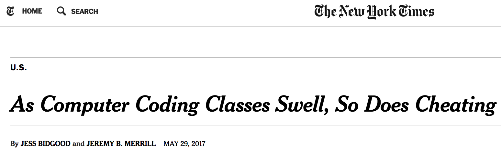

## Academic Dishonesty

```{r fig.width=6, fig.height=6, echo=FALSE}
library(png)
library(grid)
img <- readPNG("img/mit.png")
grid.raster(img)

```

## Academic Dishonesty

- Lectures on Honor Code Are Helpful
- Keeps the Honest Person Honest
- It Can Still Happen
- Google Is Easy To Use
- Stack Overflow Knowingly Aids and Abets Cheating
- Cheating is Easy to Spot

## Academic Dishonesty

- Competition
- Start the assignment late
- Later assignments rely on earlier work 
- Very easy to get help from others
- Students circulate past assignments
- Claims of language confusion

## Academic Dishonesty

In 2011 this assignment was given in the "Paradigms for Computing'' class at Stanford

```{r fig.width=6, fig.height=4.5, echo=FALSE}
library(png)
library(grid)
img <- readPNG("img/convo2.png")
grid.raster(img)

```


## Academic Dishonesty
Within 1 day this was found on the Stack Overflow site:

```{r fig.width=6, fig.height=5.5, echo=FALSE}
library(png)
library(grid)
img <- readPNG("img/stack.png")
grid.raster(img)

```

